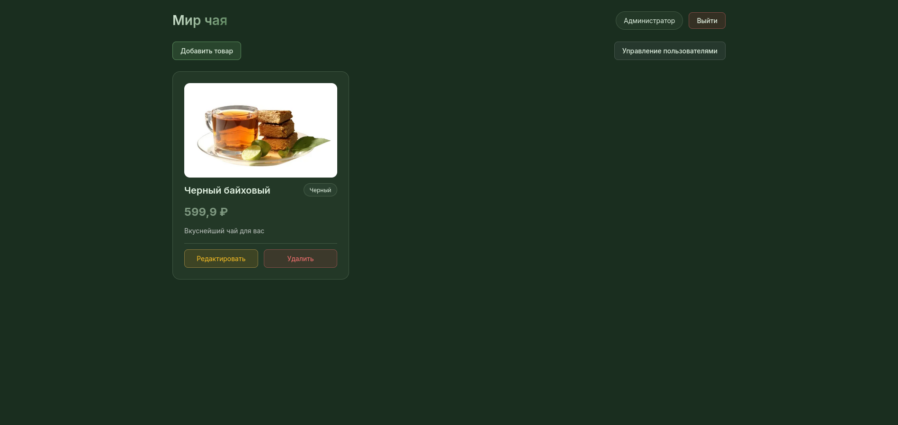

# Проект: Интернет-магазин Мир чая (Frontend + Backend)

Данный проект является итогом **Контрольной работы №2** по дисциплине «Фронтенд и бэкенд разработка» (4 семестр, 2025/2026 уч. год).  
Он объединяет задания из практических занятий №7–11 и представляет собой полноценное веб-приложение с аутентификацией, авторизацией по ролям (RBAC) и управлением товарами и пользователями.



## Стек технологий

- **Backend**: Node.js, Express.js  
- **База данных**: JSON-файл (данные сохраняются между перезапусками)  
- **Аутентификация**: JWT (access + refresh токены), bcrypt (хеширование паролей)  
- **Frontend**: React.js 
- **HTTP-клиент**: Axios (перехватчики для автоматической подстановки токенов и обновления сессии)  
- **Документация**: Swagger

## Функциональные возможности

### Управление пользователями и роли

Реализована модель **RBAC (Role-Based Access Control)**. Доступ к эндпоинтам определяется ролью пользователя:

| Роль           | Права                                                                 |
|----------------|-----------------------------------------------------------------------|
| Гость          | Только регистрация, вход, обновление токенов                          |
| Пользователь   | Просмотр товаров                                                      |
| Продавец       | Добавление и редактирование товаров                                   |
| Администратор  | Все права продавца + управление пользователями (блокировка, просмотр) |

### API эндпоинты

#### Аутентификация и пользователи

| Маршрут                | Метод   | Доступ         | Описание                               |
|------------------------|---------|----------------|----------------------------------------|
| `/api/auth/register`   | POST    | Гость          | Регистрация нового пользователя        |
| `/api/auth/login`      | POST    | Гость          | Вход, выдача access + refresh токенов  |
| `/api/auth/refresh`    | POST    | Гость          | Обновление пары токенов                |
| `/api/auth/me`         | GET     | Пользователь+  | Получение текущего пользователя        |
| `/api/users`           | GET     | Администратор  | Список всех пользователей              |
| `/api/users/:id`       | GET     | Администратор  | Получить пользователя по id            |
| `/api/users/:id`       | PUT     | Администратор  | Обновить данные пользователя           |
| `/api/users/:id`       | DELETE  | Администратор  | Заблокировать (удалить) пользователя   |

#### Товары

| Маршрут                  | Метод   | Доступ         | Описание                       |
|--------------------------|---------|----------------|--------------------------------|
| `/api/products`          | POST    | Продавец       | Создать товар                  |
| `/api/products`          | GET     | Пользователь+  | Получить список всех товаров   |
| `/api/products/:id`      | GET     | Пользователь+  | Получить товар по id           |
| `/api/products/:id`      | PUT     | Продавец       | Обновить товар                 |
| `/api/products/:id`      | DELETE  | Администратор  | Удалить товар                  |

### Frontend

Клиентская часть позволяет:

- Регистрироваться и входить в систему
- Просматривать список товаров и детальную информацию
- **Продавцу** – добавлять и редактировать товары
- **Администратору** – управлять пользователями (просмотр, редактирование, блокировка)

Токены хранятся в `localStorage`

## Соответствие практическим занятиям

### Занятие №7 – Базовые методы аутентификации
- Хеширование паролей с помощью `bcrypt` (соль добавляется автоматически)
- Реализованы маршруты `/api/auth/register`, `/api/auth/login`
- Созданы сущности `User` и `Product` с хранением в JSON-файле

### Занятие №8 – JWT токены
- Генерация **access-токена** при входе
- Middleware `authMiddleware` для проверки подлинности токена
- Защищённый маршрут `/api/auth/me`, возвращающий данные текущего пользователя

### Занятие №9 – Refresh-токены
- Добавлена генерация **refresh-токена** (срок жизни 7 дней)
- Эндпоинт `/api/auth/refresh` для обновления пары токенов
- Ротация refresh-токенов (старый удаляется, новый создаётся)

### Занятие №10 – Хранение токенов на фронтенде
- Использован `localStorage` для хранения access и refresh токенов
- Настроены **Axios interceptors**:
  - Автоматическая подстановка `Authorization: Bearer <accessToken>` в каждый запрос
  - Перехват ответов с ошибкой 401 и автоматический вызов `/api/auth/refresh` для обновления токена

### Занятие №11 – Управление доступом на основе ролей (RBAC)
- Реализованы роли: `guest`, `user`, `seller`, `admin`
- Middleware `roleMiddleware(roles)` для ограничения доступа к эндпоинтам
- Администратор может управлять пользователями, продавец – товарами

### Занятие №12 – Подготовка к контрольной работе №2
- Проведено тестирование всех маршрутов
- Написан данный `README.md`
- Репозиторий открыт для проверки

## Запуск проекта

### 1. Клонирование репозитория
```bash
git clone https://github.com/ZenesDK/FrontEnd-BackEnd-KR2
cd FrontEnd-BackEnd-KR2
```

### 2. Запуск серверной части
```bash
cd backend
npm install
npm start
```
Сервер запустится на `http://localhost:3000`

### 3. Запуск клиентской части
```bash
cd frontend
npm install
npm start
```
Фронтенд будет доступен на `http://localhost:3001` (или другом порту)

## Тестирование

- Все эндпоинты протестированы в **Postman**
- Проверена работа `authMiddleware` и `roleMiddleware`
- Проверена автоматическая ротация токенов через интерсепторы Axios
- Тестовые сценарии:
  - Регистрация → вход → получение `me`
  - Попытка продавца создать товар
  - Попытка администратора получить список пользователей
  - Истечение access-токена и автоматическое обновление

## Ссылка на репозиторий

**[https://github.com/ZenesDK/FrontEnd-BackEnd-KR2]**